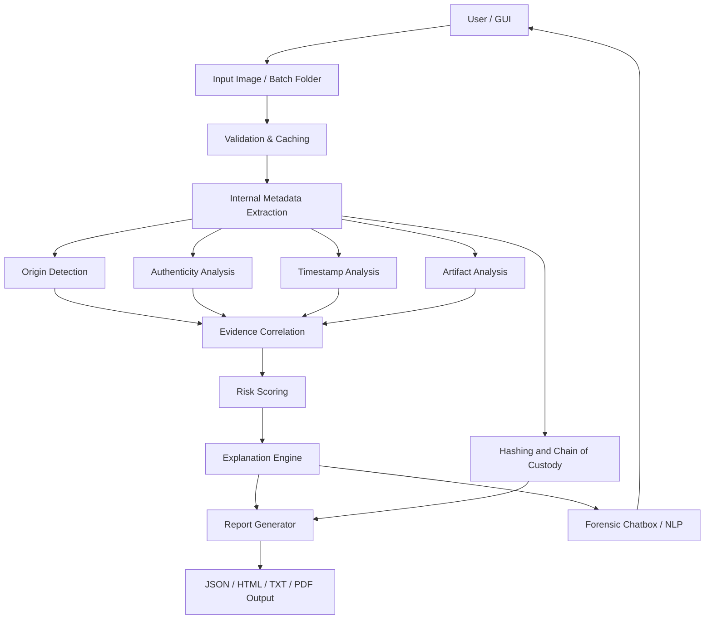
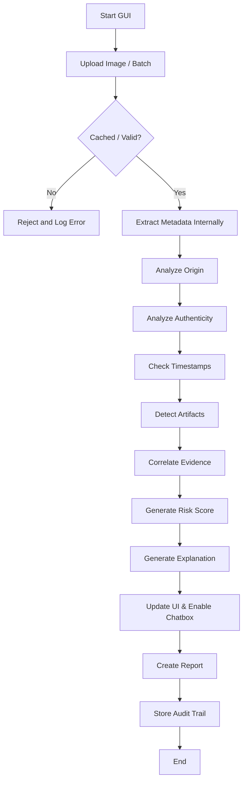
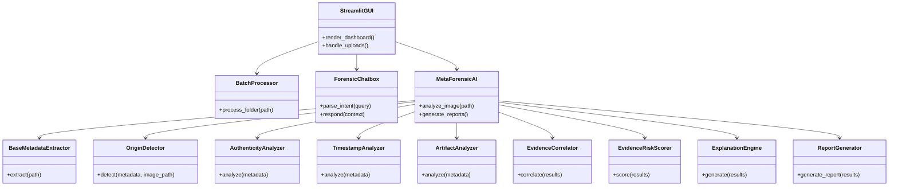
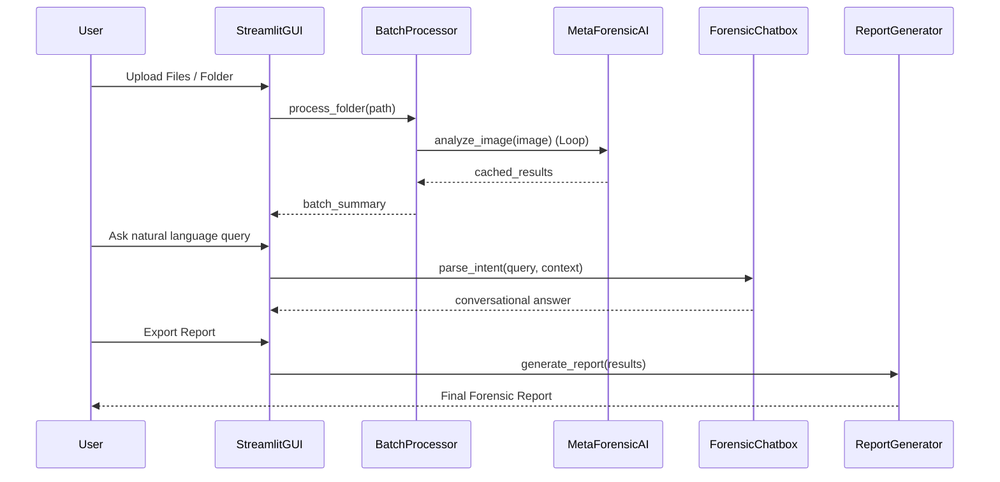

# Metadata Extraction and Image Analysis System for Digital Forensics

## Authors

Harish et al.  
Affiliation, department, institution, city, country  
Corresponding author email

## Abstract

Digital images are widely used as evidence in legal, forensic, cybersecurity, and social-media investigations. However, the reliability of digital images is increasingly challenged by metadata tampering, editing software, recompression, screenshots, and AI-generated content. This research presents MetaForensicAI, a Metadata Extraction and Image Analysis System for Digital Forensics that performs batch image validation, internal metadata extraction, provenance analysis, authenticity-oriented assessment, timestamp checking, evidence correlation, and structured report generation in a unified graphical workflow. The proposed system follows a modular Python-based architecture and integrates an interactive forensic chatbox, analysis modules, and reporting components to support explainable decision-making. Instead of depending on system-level external tools or a single indicator, the system combines metadata strength, software traces, structural cues, screenshot signals, and synthetic-content indicators to derive practical origin classes. The work is positioned as a systems-oriented research contribution and is intended for further strengthening with controlled experiments, validated metrics, and formal citations before submission.

## 1. INTRODUCTION

Digital images have become one of the most important forms of digital evidence. They are used in cybercrime investigation, journalism, insurance verification, legal proceedings, and law-enforcement analysis. A single image may influence a case decision, establish the timing of an event, or support the authenticity of a claim. Because of this, image reliability has become a major research and practical concern.

Traditional image inspection methods often rely on visible content or limited metadata review. In real-world scenarios, this is insufficient. Images may pass through editing tools, messaging applications, social platforms, or screen-capture workflows before reaching the investigator. In addition, modern generative AI tools can create photorealistic images with little or no trustworthy metadata. These changes create a need for a forensic system that can analyze multiple sources of evidence and explain its conclusion clearly.

The proposed project addresses this need by developing MetaForensicAI, a metadata extraction and image analysis system that combines extraction, analysis, scoring, interactive explanation, and reporting in a single workflow. It features a streamlined graphical user interface (GUI) supporting batch folder processing, efficient caching for rapid re-analysis, and an integrated forensic chatbox powered by natural language processing (NLP) to conversationalize metadata exploration. The system is intended to support digital investigators by offering practical provenance analysis rather than only raw metadata display.

## 2. LITERATURE SURVEY

Digital image forensics research has developed across several related directions.

Metadata-based forensics studies focus on EXIF, XMP, GPS, software strings, and device information to infer the origin and history of an image. These approaches are useful because they are interpretable, but they become weak when metadata are missing, stripped, or intentionally modified.

Compression and structural forensics examine JPEG quantization, double compression, container anomalies, and file-structure irregularities. These methods are valuable when metadata are unreliable, but they may not always provide complete provenance context.

Source attribution and camera forensics research investigates sensor noise, demosaicing traces, and camera-specific acquisition patterns. Such methods help distinguish native camera captures from transformed or synthetic images.

Recent studies also address screenshot detection, social-media redistribution effects, and AI-generated image detection. These areas are especially important because screenshots often remove original camera evidence, and AI-generated images can imitate photographic realism while lacking stable provenance markers.

Existing tools often solve only one part of the problem, such as metadata inspection or manipulation detection, typically through command-line interfaces. The research gap lies in building an integrated forensic workflow that combines internal metadata extraction, provenance reasoning, authenticity analysis, explanation, batch processing, and conversational natural language querying (NLP) in a unified graphical system.

## 3. IMPLEMENTATION STUDY

The implementation study examines both the limitations of existing approaches and the design of the proposed system.

### 3.1 Existing System

Existing image-forensic solutions commonly show one or more of the following limitations:

1. Over-reliance on metadata fields that can be removed or forged.
2. Weak distinction between camera images, edited images, screenshots, and AI-generated content.
3. Limited explainability, where systems output labels or scores without reasoning.
4. Lack of integrated forensic traceability such as hashing, logging, and chain-of-custody support.
5. Poor support for batch analysis and report generation in investigator-facing workflows.

In many current approaches, metadata extraction and authenticity assessment are handled as separate tasks. This fragmentation makes practical forensic review slower and less consistent.

### 3.2 Proposed System

The proposed MetaForensicAI system is a modular forensic pipeline built to combine multiple evidence sources into a single analytical workflow. It features:

- a robust Streamlit Graphical User Interface (GUI);
- batch folder processing with session-state caching;
- an interactive Forensic Chatbox powered by Natural Language Processing (NLP);
- file validation and evidence-safe input handling;
- internal metadata extraction from image files;
- origin detection using multi-signal fusion;
- authenticity-oriented analysis;
- timestamp validation and artifact analysis;
- evidence correlation and risk scoring;
- explanation generation and structured report export.

The proposed system treats provenance analysis as a fusion problem. Instead of using only EXIF fields, it examines metadata density, software identifiers, screenshot cues, re-encoding signals, structural information, and synthetic-content indicators. These signals are then combined into practical classes such as camera-captured image, edited image, screenshot, AI-generated image, synthetic image, or unknown origin.

### Architecture Diagram

The architecture follows a layered forensic design. Input images are first validated and processed for metadata extraction. The extracted information then flows into several parallel analysis modules. Their outputs are fused through an evidence-correlation stage, after which the system produces scores, explanations, and final reports.

### Flow Chart

The flow chart shows the operational sequence followed by the system for each image. The process begins with validation, continues through multiple analytical stages, and ends with documented output generation.

### UML Diagrams

#### UML Class Diagram

#### UML Sequence Diagram

The UML diagrams describe the main software structure and the interaction among the major classes in the system.

## 4. SOFTWARES AND LIBRARIES DESCRIPTION, TECHNOLOGY DETAILS

The system is implemented in Python and uses a modular repository structure. The major software technologies and libraries used in project include the following.

### 4.1. Image & Multimedia Processing
- **Pillow / pillow-heif**: Foundational libraries for image loading, format validation, reading embedded color profiles, structural validation and handling HEIF/HEIC Apple formats.
- **opencv-python (OpenCV)**: Used for advanced pixel-level forensic operations (e.g., Error Level Analysis, noise variation, structural analysis) and transformations.

### 4.2. Metadata Extraction & Provenance
- **exifread & piexif**: Python-native reading and parsing of EXIF and metadata markers.
- **pyexiv2**: Currently being integrated as a robust C++ binding for EXIF, IPTC and XMP metadata extraction.
- **ExifTool (External Perl tool)**: A robust, platform-independent tool natively integrated for advanced metadata extractions like C2PA (Content Authenticity Initiative) data and specialized manufacturer notes.

### 4.3. Machine Learning & Data Science
- **scikit-learn**: For risk scoring, clustering algorithms, decision heuristics and traditional machine learning integration.
- **torch (PyTorch) & torchvision**: Configured as an optional dependency for deep learning features, utilized for CNNs and Transformer-based manipulation detection and image content analysis.
- **numpy, pandas, & scipy**: Used for statistical calculation, large-scale matrix operations, managing evidence correlation datasets and scientific calculations.
- **joblib**: For loading and saving trained AI models computationally efficiently.

### 4.4. Utilities, Formatting & Output Generation
- **reportlab**: Used to generate forensic PDF reports algorithmically from findings.
- **Jinja2**: For templating HTML reports.
- **rich**: For stylized, colorful command-line outputs, tables and traceback formatting for investigator-facing CLI tools.
- **json5 & PyYAML**: To manage configuration files (forensic_config.yaml) and structured JSON results.
- **ImageHash**: Used for generating perceptual hashes (pHash, aHash, wHash) to correlate duplicate or modified evidence copies visually.

### 4.5. System, Networking & Command-Line Interfaces (CLI)
- **click & prompt-toolkit**: Provide advanced command-line navigation and interactive prompts.
- **psutil**: To monitor system memory usage during large batch forensic operations and chunking large folders.
- **requests**: For contacting external APIs, resolving GPS coordinates (reverse geocoding features) or verifying threat intelligence hashes online.
- **tqdm**: Command-line progress bars during analysis steps.
- **tzlocal, pytz, python-dateutil**: Comprehensive timezone and timestamp checking across metadata extraction logic.

### 4.6. Code Quality, Development & Testing
- **pytest & pytest-cov**: For unit and integration testing of the forensic modules.
- **black, isort, & flake8**: Code formatting, sorting imports and identifying syntactical bugs.
- **mypy**: Static type checking to ensure code reliability.

### 4.7. Potential Frameworks (Configured as Optional / Currently Unused)
- **flask & flask-cors**: The architecture supports serving the forensic system via a web API, though the current implementation leverages Streamlit for the primary GUI.
- **sqlite**: Handled via Python's standard library to preserve forensic findings and chain-of-custody in a persistent database format.

### 4.8 Project Modules
- `src/interface`: Streamlit GUI, Forensic Chatbox, and natural language processing logic.
- `src/core`: main orchestration, batch processing, evidence handling, and internal metadata extraction.
- `src/analysis`: authenticity, artifact, timestamp, contextual, and risk-analysis modules (including Bayesian Scorer and Origin Detector).
- `src/explanation`: explanation-generation logic for human-readable reasoning.
- `src/reporting`: forensic report generation and structured output formatting.
- `src/utils`: hashing, logging, file validation, and supporting wrappers.

### 4.9 Technology Details
The technology stack is designed around explainable forensic processing rather than black-box prediction alone. The system uses:
1. metadata-driven evidence collection;
2. heuristic and rule-based forensic analysis;
3. multi-signal origin detection;
4. evidence correlation and scoring;
5. report-centric output generation.

This combination makes the project suitable for forensic practice, where interpretability and traceability are as important as analytical performance.

## 5. CONCLUSION

This research paper presented a Metadata Extraction and Image Analysis System for Digital Forensics designed to support practical image provenance and authenticity assessment. The system addresses the weaknesses of existing fragmented approaches by integrating metadata extraction, origin detection, timestamp validation, artifact analysis, evidence correlation, explanation generation, and reporting in a single workflow. The proposed design emphasizes explainability, forensic traceability, and modular implementation.

The project provides a strong systems-oriented foundation for publication. To strengthen the paper further, the next step is to add experimentally verified results, formal literature citations, and finalized benchmark tables. Even in its current form, the system demonstrates a clear research contribution in the area of digital image forensics.
